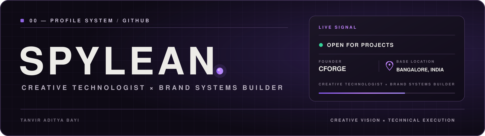
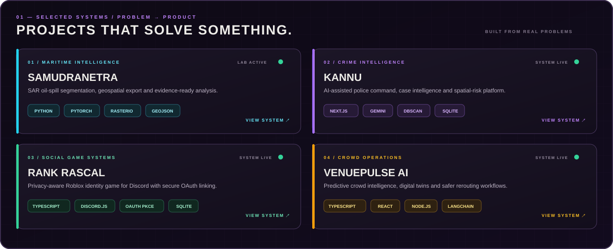
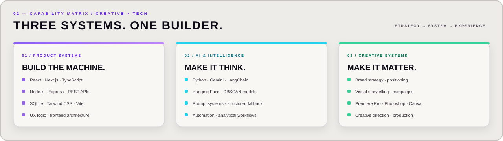
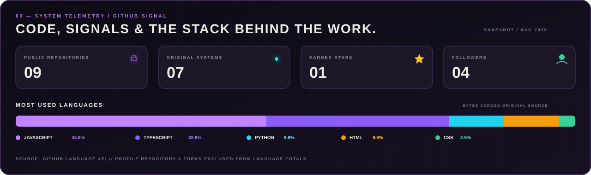
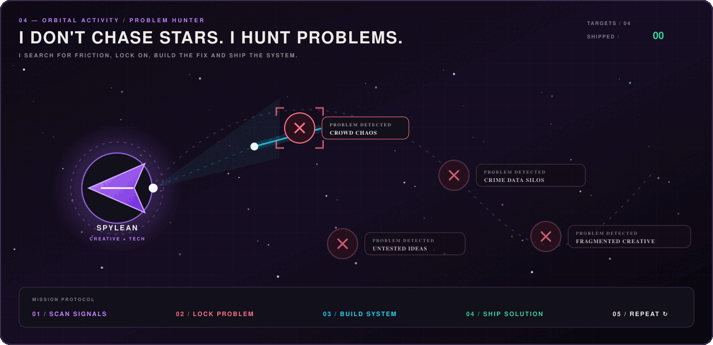
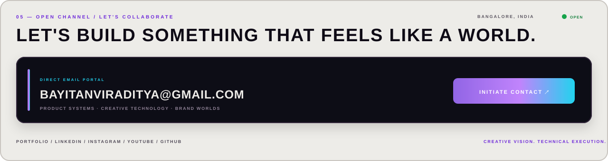

  

  
  
  
  
  

<h3 align="center">I build brands, content, digital products and experiences that feel like worlds.</h3>

  Founder, <a href="https://cforge-studio.vercel.app/"><strong>CFORGE</strong></a>
  &nbsp;·&nbsp; Building <strong>LETMEIN</strong>
  &nbsp;·&nbsp; Creative Director

---

  

  
  
  
  

  

  

  

---

  

  SPYLEAN / BANGALORE, INDIA / CREATIVE × TECH

