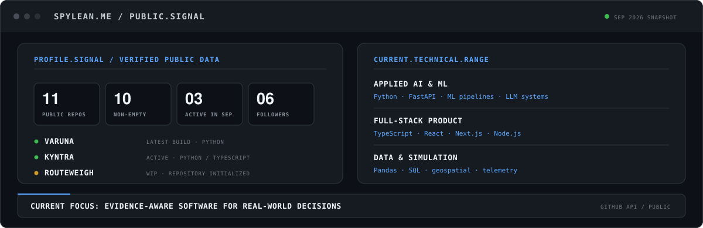

  <picture>
    <source media="(prefers-color-scheme: dark)" srcset="./spylean-identity-v5-dark.svg" />
    <source media="(prefers-color-scheme: light)" srcset="./spylean-identity-v5-light.svg" />
    
  </picture>

  <a href="https://spylean-portfolio.vercel.app/">Portfolio</a>
  &nbsp;·&nbsp;
  <a href="https://cforge-studio.vercel.app/">CFORGE</a>
  &nbsp;·&nbsp;
  <a href="https://www.linkedin.com/in/tanvir-aditya-bayi-7a6177304/">LinkedIn</a>
  &nbsp;·&nbsp;
  <a href="https://www.youtube.com/@SPYLEAN">YouTube</a>
  &nbsp;·&nbsp;
  <a href="mailto:bayitanviraditya@gmail.com">Email</a>

## About

I’m **Tanvir Aditya Bayi**, a B.Tech Computer Science student and creative technologist from Bengaluru. I build AI-assisted and full-stack systems across maritime intelligence, motorsport, public-safety analytics, platform identity and crowd operations.

My work focuses on evidence, constraints, security and usable interfaces—not just demos that look convincing. I’m also the founder of [CFORGE](https://cforge-studio.vercel.app/), where I work across technology, creative direction and product execution.

## Current signal

  <picture>
    <source media="(prefers-color-scheme: dark)" srcset="./spylean-signal-v2-dark.svg" />
    <source media="(prefers-color-scheme: light)" srcset="./spylean-signal-v2-light.svg" />
    
  </picture>

## Selected engineering work

  <picture>
    <source media="(prefers-color-scheme: dark)" srcset="./spylean-operations-v5-dark.svg" />
    <source media="(prefers-color-scheme: light)" srcset="./spylean-operations-v5-light.svg" />
    
  </picture>

  <a href="https://github.com/SPYLEAN/Varuna-maritime"><kbd>01 · VARUNA ↗</kbd></a>
  &nbsp;
  <a href="https://github.com/SPYLEAN/KYNTRA"><kbd>02 · KYNTRA ↗</kbd></a>
  &nbsp;
  <a href="https://github.com/SPYLEAN/datathon-2026"><kbd>03 · KANNU ↗</kbd></a>
  &nbsp;
  <a href="https://github.com/SPYLEAN/Rank-Rascal"><kbd>04 · Rank Rascal ↗</kbd></a>
    
  <a href="https://github.com/SPYLEAN/Crowd-flow-optimizer"><kbd>05 · VenuePulse AI ↗</kbd></a>
  &nbsp;
  <a href="https://github.com/SPYLEAN/Sentinel-memory"><kbd>06 · Sentinel Memory ↗</kbd></a>

### Building now

- [**RouteWeigh**](https://github.com/SPYLEAN/routeweigh) — adaptive trip optimization; public repository initialized and implementation in progress
- [**VARUNA**](https://github.com/SPYLEAN/Varuna-maritime) — production-candidate maritime oil-spill investigation workflow
- [**KYNTRA**](https://github.com/SPYLEAN/KYNTRA) — predictive racecraft, telemetry and energy decision intelligence

### Deployed product work

- [**LETMEIN**](https://letme-in.vercel.app/) — product and booking experience
- [**Vertex × Cozyan**](https://vertex-cozyan-site.vercel.app/) — gaming lounge and café platform

## Stack

  <kbd>Python</kbd>
  <kbd>TypeScript</kbd>
  <kbd>JavaScript</kbd>
  <kbd>React</kbd>
  <kbd>Next.js</kbd>
  <kbd>FastAPI</kbd>
  <kbd>Node.js</kbd>
  <kbd>SQL</kbd>
  <kbd>Applied ML</kbd>
  <kbd>Geospatial</kbd>
  <kbd>Simulation</kbd>
  <kbd>Data Systems</kbd>

---

## Open channel

I’m open to **software engineering, AI/ML and creative technology internships**, as well as ambitious product collaborations. If the problem is interesting and the outcome needs to be thoughtful, [start a conversation](mailto:bayitanviraditya@gmail.com).

Bengaluru, India · Research → systems → shipped work
