  <picture>
    <source media="(prefers-color-scheme: dark)" srcset="./spylean-identity-v3-dark.svg" />
    <source media="(prefers-color-scheme: light)" srcset="./spylean-identity-v3-light.svg" />
    
  </picture>

  <a href="https://spylean-portfolio.vercel.app/">Portfolio</a>
  &nbsp;·&nbsp;
  <a href="https://cforge-studio.vercel.app/">CFORGE</a>
  &nbsp;·&nbsp;
  <a href="https://www.linkedin.com/in/tanvir-aditya-bayi-7a6177304/">LinkedIn</a>
  &nbsp;·&nbsp;
  <a href="https://www.youtube.com/@SPYLEAN">YouTube</a>
  &nbsp;·&nbsp;
  <a href="mailto:bayitanviraditya@gmail.com">Email</a>

## About the operator

I’m a creative technologist and systems builder from Bangalore. I work where product engineering, applied intelligence and brand experience meet—turning real problems into tools people can actually use.

Founder of [CFORGE](https://cforge-studio.vercel.app/). Building software, creative systems and experiments in public under the name **SPYLEAN**.

### Operations log

  <picture>
    <source media="(prefers-color-scheme: dark)" srcset="./spylean-operations-v3-dark.svg" />
    <source media="(prefers-color-scheme: light)" srcset="./spylean-operations-v3-light.svg" />
    
  </picture>

  <a href="https://github.com/SPYLEAN/SamudraNetra"><kbd>01 · SamudraNetra ↗</kbd></a>
  &nbsp;
  <a href="https://github.com/SPYLEAN/datathon-2026"><kbd>02 · KANNU ↗</kbd></a>
  &nbsp;
  <a href="https://github.com/SPYLEAN/Rank-Rascal"><kbd>03 · Rank Rascal ↗</kbd></a>
    
  <a href="https://github.com/SPYLEAN/Crowd-flow-optimizer"><kbd>04 · VenuePulse AI ↗</kbd></a>
  &nbsp;
  <a href="https://www.letme.co.in/"><kbd>05 · LETMEIN ↗</kbd></a>
  &nbsp;
  <a href="https://vertex-cozyan-site.vercel.app/"><kbd>06 · Vertex × Cozyan ↗</kbd></a>

### Other systems

- [**Sentinel Memory**](https://github.com/SPYLEAN/Sentinel-memory) — operational memory for physical spaces
- [**Startup Validator**](https://github.com/SPYLEAN/setup-validator) — structured evidence for early-stage ideas

Bangalore, India · Problems → systems → shipped work

---

### Open channel

I’m open to ambitious product, technology and creative collaborations. If the problem is interesting and the outcome needs to feel considered, [start a conversation](mailto:bayitanviraditya@gmail.com).
