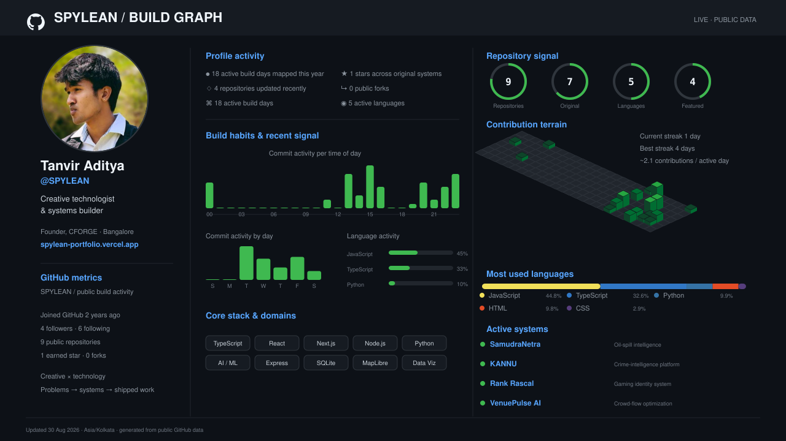

  <picture>
    <source media="(prefers-color-scheme: dark)" srcset="./spylean-system-dark.svg" />
    <source media="(prefers-color-scheme: light)" srcset="./spylean-system-light.svg" />
    
  </picture>

  <a href="https://spylean-portfolio.vercel.app/">Portfolio</a>
  &nbsp;·&nbsp;
  <a href="https://cforge-studio.vercel.app/">CFORGE</a>
  &nbsp;·&nbsp;
  <a href="https://www.linkedin.com/in/tanvir-aditya-bayi-7a6177304/">LinkedIn</a>
  &nbsp;·&nbsp;
  <a href="https://www.youtube.com/@SPYLEAN">YouTube</a>
  &nbsp;·&nbsp;
  <a href="mailto:bayitanviraditya@gmail.com">Email</a>

## About the operator

I’m a creative technologist and systems builder from Bangalore. I work where product engineering, applied intelligence and brand experience meet—turning real problems into tools people can actually use.

Founder of [CFORGE](https://cforge-studio.vercel.app/). Building software, creative systems and experiments in public under the name **SPYLEAN**.

### Current build queue

| System | Problem being solved | Build signal |
| --- | --- | --- |
| [**SamudraNetra**](https://github.com/SPYLEAN/SamudraNetra) | Detecting, tracking and attributing marine oil spills | `Python` `PyTorch` `Rasterio` `GeoJSON` |
| [**KANNU**](https://github.com/SPYLEAN/datathon-2026) | Turning fragmented crime records into explainable intelligence | `Next.js` `Gemini` `DBSCAN` `SQLite` |
| [**Rank Rascal**](https://github.com/SPYLEAN/Rank-Rascal) | Building a privacy-aware Roblox identity and Discord game system | `TypeScript` `Discord.js` `OAuth` `PostgreSQL` |
| [**VenuePulse AI**](https://github.com/SPYLEAN/Crowd-flow-optimizer) | Predicting crowd pressure before it becomes dangerous | `TypeScript` `React` `Node.js` `LangChain` |

### Operating range

- **Product systems:** React, Next.js, TypeScript, Node.js, Express, REST APIs and SQLite.
- **Applied intelligence:** Python, Gemini, LangChain, Hugging Face, geospatial analysis and data visualization.
- **Creative systems:** brand strategy, campaigns, content production, experience design and creative direction.

### Additional systems

- [**LETMEIN**](https://www.letme.co.in/) — campus access infrastructure
- [**Sentinel Memory**](https://github.com/SPYLEAN/Sentinel-memory) — operational memory for physical spaces
- [**Startup Validator**](https://github.com/SPYLEAN/setup-validator) — structured evidence for early-stage ideas
- [**Vertex × Cozyan**](https://vertex-cozyan-site.vercel.app/) — booking and venue experience platform

### Live build graph

  <picture>
    <source media="(prefers-color-scheme: dark)" srcset="./spylean-live-metrics-dark.svg" />
    <source media="(prefers-color-scheme: light)" srcset="./spylean-live-metrics-light.svg" />
    
  </picture>

Updated automatically from public GitHub data · Bangalore, India · Problems → systems → shipped work

---

### Open channel

I’m open to ambitious product, technology and creative collaborations. If the problem is interesting and the outcome needs to feel considered, [start a conversation](mailto:bayitanviraditya@gmail.com).
