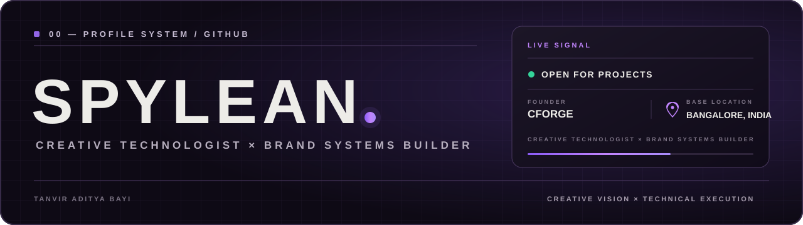

  

  
  
  
  
  

<h3 align="center">I build brands, content, digital products and experiences that feel like worlds.</h3>

  Founder, <a href="https://cforge-studio.vercel.app/"><strong>CFORGE</strong></a>
  &nbsp;·&nbsp; Building <strong>LETMEIN</strong>
  &nbsp;·&nbsp; Creative Director

---

## `01 — CURRENT TRANSMISSION`

<table>
  <tr>
    <td width="33%" valign="top">
      IDENTITY  
      <strong>Creative technologist.</strong> 
      Brand systems builder and founder translating ideas into products, campaigns and complete digital worlds.
    </td>
    <td width="33%" valign="top">
      NOW BUILDING  
      <strong>AI-assisted products.</strong> 
      Operational dashboards, intelligent workflows, creative platforms and human-centered technical systems.
    </td>
    <td width="33%" valign="top">
      OPEN CHANNEL  
      <strong>Available for projects.</strong> 
      Product builds, brand systems, creative direction and ambitious collaborations from Bangalore, India.
    </td>
  </tr>
</table>

## `02 — SELECTED SYSTEMS`

<table>
  <tr>
    <td width="50%" valign="top">
      01 / CRIME INTELLIGENCE
      <h3>KANNU — Police Command Platform</h3>
      AI-assisted crime intelligence and case-management platform with spatial risk clustering, operational dashboards and structured analysis workflows.
        
      <code>Next.js</code> <code>React</code> <code>Gemini</code> <code>Python</code> <code>SQLite</code>
        
      <a href="https://github.com/SPYLEAN/datathon-2026"><strong>VIEW SYSTEM →</strong></a>
    </td>
    <td width="50%" valign="top">
      02 / CROWD OPERATIONS
      <h3>VenuePulse AI</h3>
      Real-time crowd intelligence console that models venues as digital twins, forecasts bottlenecks and proposes operator-approved rerouting strategies.
        
      <code>TypeScript</code> <code>React</code> <code>Node.js</code> <code>LangChain</code> <code>Canvas</code>
        
      <a href="https://github.com/SPYLEAN/Crowd-flow-optimizer"><strong>VIEW SYSTEM →</strong></a>
    </td>
  </tr>
  <tr>
    <td width="50%" valign="top">
      03 / STARTUP INTELLIGENCE
      <h3>Startup Idea Validator</h3>
      Full-stack validation and analytics platform with secure authentication, lifecycle-aware idea management and dynamic popularity scoring.
        
      <code>JavaScript</code> <code>Express</code> <code>SQLite</code> <code>JWT</code> <code>REST API</code>
        
      <a href="https://github.com/SPYLEAN/setup-validator"><strong>VIEW SYSTEM →</strong></a>
    </td>
    <td width="50%" valign="top">
      04 / FOUNDER-LED STUDIO
      <h3>CFORGE</h3>
      A creator collective and production system spanning brand strategy, campaigns, reels, websites and digital experiences.
        
      <code>Brand Systems</code> <code>Creative Direction</code> <code>Production</code> <code>Web</code>
        
      <a href="https://cforge-studio.vercel.app/"><strong>ENTER CFORGE →</strong></a>
    </td>
  </tr>
</table>

## `03 — CAPABILITY MATRIX`

<table>
  <tr>
    <td width="33%" valign="top">
      PRODUCT SYSTEMS  
      <strong>React · Next.js · TypeScript</strong> 
      Node.js · Express · REST APIs 
      SQLite · Tailwind CSS · Vite
    </td>
    <td width="33%" valign="top">
      AI &amp; INTELLIGENCE  
      <strong>Python · Gemini · LangChain</strong> 
      Hugging Face · DBSCAN 
      Prompt systems · Automation
    </td>
    <td width="33%" valign="top">
      CREATIVE SYSTEMS  
      <strong>Brand strategy · Storytelling</strong> 
      Premiere Pro · Photoshop · Canva 
      Campaigns · Creative direction
    </td>
  </tr>
</table>

## `04 — SYSTEM TELEMETRY`

  
  

## `05 — ORBITAL ACTIVITY`

  

---

  SPYLEAN / BANGALORE, INDIA / CREATIVE × TECH  
  <strong>LET'S BUILD SOMETHING THAT FEELS LIKE A WORLD.</strong>

