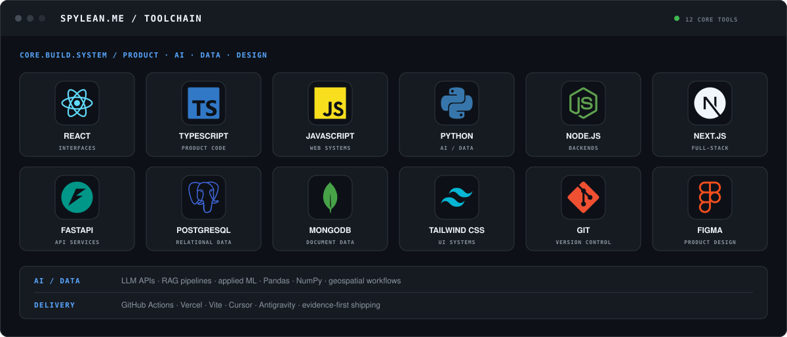
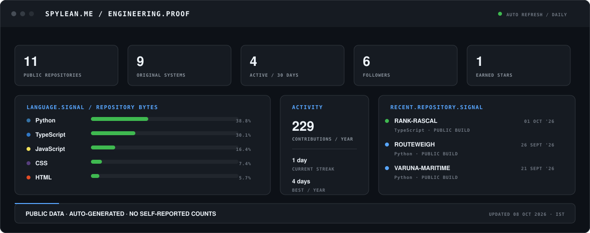

  <picture>
    <source media="(prefers-color-scheme: dark)" srcset="./spylean-identity-v6-dark.svg" />
    <source media="(prefers-color-scheme: light)" srcset="./spylean-identity-v6-light.svg" />
    
  </picture>

  <a href="https://spylean-portfolio.vercel.app/">Portfolio</a>
  &nbsp;·&nbsp;
  <a href="https://cforge-studio.vercel.app/">CFORGE</a>
  &nbsp;·&nbsp;
  <a href="https://circuitclub.in/">Circuit Club</a>
  &nbsp;·&nbsp;
  <a href="https://www.linkedin.com/in/tanvir-aditya-bayi-7a6177304/">LinkedIn</a>
  &nbsp;·&nbsp;
  <a href="https://www.youtube.com/@SPYLEAN">YouTube</a>
  &nbsp;·&nbsp;
  <a href="mailto:bayitanviraditya@gmail.com">Email</a>

## About

I’m **Tanvir Aditya Bayi**, a B.Tech Computer Science student and creative technologist from Bengaluru. I build full-stack products across applied AI, data systems, games and real-world culture.

I care about useful interfaces, honest engineering and products people can actually experience—not just demos that look convincing. I’m the founder of [CFORGE](https://cforge-studio.vercel.app/) and co-founder of [Circuit Club](https://circuitclub.in/), where two friends and I are building recurring offline experiences for Bengaluru’s movement, music and creator culture.

## Toolchain

  <picture>
    <source media="(prefers-color-scheme: dark)" srcset="./spylean-toolchain-v2-dark.svg" />
    <source media="(prefers-color-scheme: light)" srcset="./spylean-toolchain-v2-light.svg" />
    
  </picture>

## Live engineering proof

  <picture>
    <source media="(prefers-color-scheme: dark)" srcset="./spylean-signal-v3-dark.svg" />
    <source media="(prefers-color-scheme: light)" srcset="./spylean-signal-v3-light.svg" />
    
  </picture>

## Selected engineering work

  <picture>
    <source media="(prefers-color-scheme: dark)" srcset="./spylean-operations-v6-dark.svg" />
    <source media="(prefers-color-scheme: light)" srcset="./spylean-operations-v6-light.svg" />
    
  </picture>

  <a href="https://circuitclub.in/"><kbd>01 · Circuit Club ↗</kbd></a>
  &nbsp;
  <a href="https://rankrascal.lol/"><kbd>02 · Rascal Realms ↗</kbd></a>
  &nbsp;
  <a href="https://dinescope.vercel.app/"><kbd>03 · DineScope ↗</kbd></a>
  &nbsp;
  <a href="https://github.com/SPYLEAN/Varuna-maritime"><kbd>04 · VARUNA ↗</kbd></a>
    
  <a href="https://github.com/SPYLEAN/KYNTRA"><kbd>05 · KYNTRA ↗</kbd></a>
  &nbsp;
  <a href="https://github.com/SPYLEAN/datathon-2026"><kbd>06 · KANNU ↗</kbd></a>
  &nbsp;
  <a href="https://letme-in.vercel.app/"><kbd>07 · LETMEIN ↗</kbd></a>
  &nbsp;
  <a href="https://vertex-cozyan-site.vercel.app/"><kbd>08 · Vertex × Cozyan ↗</kbd></a>

### Building now

- [**Rascal Realms: Crownfall**](https://rankrascal.lol/) — a 1–4 player Roblox co-op action-mystery RPG in pre-production; investigate contradictions, accuse the lie and survive the world’s correction
- [**VARUNA**](https://github.com/SPYLEAN/Varuna-maritime) — evidence-aware maritime oil-spill investigation using SAR, OpenDrift and AIS analysis
- [**KYNTRA**](https://github.com/SPYLEAN/KYNTRA) — predictive racecraft, telemetry and energy decision intelligence

### Deployed product work

- [**Circuit Club**](https://circuitclub.in/) — a Bengaluru culture and experience platform, co-founded with two collaborators; movement, music, creators and brands meet through limited offline “Drops”
- [**DineScope**](https://dinescope.vercel.app/) — restaurant discovery with aspect-level review sentiment for food, service, ambience and value
- [**LETMEIN**](https://letme-in.vercel.app/) — product and booking experience
- [**Vertex × Cozyan**](https://vertex-cozyan-site.vercel.app/) — gaming lounge and café platform

### More engineering systems

- [**KANNU**](https://github.com/SPYLEAN/datathon-2026) — explainable crime-intelligence and case operations
- [**VenuePulse AI**](https://github.com/SPYLEAN/Crowd-flow-optimizer) — crowd-flow prediction and operator-guided incident response
- [**Sentinel Memory**](https://github.com/SPYLEAN/Sentinel-memory) — operational memory and recommendations for complex venues

---

## Open channel

I’m open to **software engineering, AI/ML and creative technology internships**, as well as ambitious product collaborations. If the problem is interesting and the outcome needs to be thoughtful, [start a conversation](mailto:bayitanviraditya@gmail.com).

Bengaluru, India · Research → systems → shipped work
